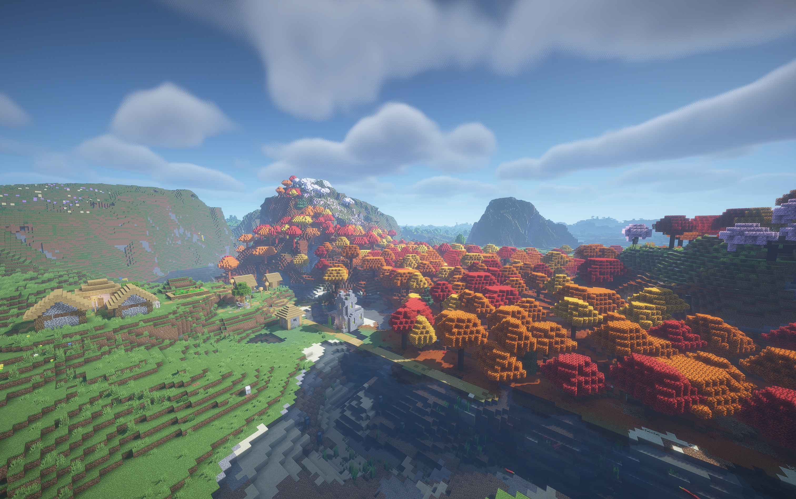

# MCUpscaler for Minecraft (Fabric 26.3, Vulkan)

Upscaling and frame generation for Minecraft's Vulkan renderer, on Windows and macOS. The world renders at a lower
resolution and is upscaled, while the HUD and menus stay at full resolution.

| | Windows | macOS |
|---|---|---|
| Upscalers | NVIDIA DLSS 4 (RTX cards), AMD FSR 3.1 (any GPU), Bilinear | Apple MetalFX Temporal, AMD FSR 3.1, MetalFX Spatial, Bilinear |
| Frame generation | DLSS Frame Generation (RTX 40/50), AMD FSR 3.1 | MetalFX (macOS 26+), AMD FSR 3.1 (macOS 14+) |
| Latency | NVIDIA Reflex | – |

One jar works on both: it picks the platform's options at startup.



## Requirements

- Minecraft 26.3 with the **Vulkan** graphics backend (Video Settings → Graphics API → Prefer
  Vulkan), Fabric Loader 0.19.5+, Fabric API, Java 25.
- Windows 10/11 x64, or macOS 13+.
- Remove the older **DLSS** (`dlssmc`) and **MetalFX** (`metalfx`) mods: this one replaces both and takes over their
  settings the first time it runs.

Optional:

- **Sodium**: recommended; adds the *Upscaling* page to Video Settings. Without it, use the key bindings or
  `config/mcupscaler.properties`.
- **Vitrail** shader packs (tested with Bliss, BSL and Complementary) and **Distant Horizons** are supported.

## Settings

Video Settings → Upscaling (with Sodium):

| Setting | What it does |
|---|---|
| Enable Upscaling | Render the world at a lower resolution and upscale it |
| Upscaler | The platform's upscalers (above). Ones your GPU can't run are crossed out |
| Quality Mode | Auto (by screen size), Native AA (100%), Quality, Balanced, Performance, Ultra Performance or Custom |
| Sharpness | Sharpening for FSR and MetalFX |
| DLSS Preset | Windows, DLSS only |
| Frame Generation | Off, or the platform's frame generators |
| NVIDIA Reflex | Windows, NVIDIA cards |
| Texture LOD Correction, Still Shader Pack Foliage | Advanced; see their tooltips |

Controls → MCUpscaler has unbound keys to toggle upscaling and step through upscalers, quality modes and frame
generation. The MCUpscaler section of the F3 screen shows what is running.

## Building

The release jar is built on **Windows**; it contains the Windows natives it builds and the committed macOS dylib in
`prebuilt/natives/`.

```
./gradlew build                 # jar in build/libs
./gradlew deployToInstance -Pinstance_mods_dir=<mods folder>
./gradlew runClientGameTest     # automated test world + screenshots in build/run/clientGameTest/screenshots
```

**Windows** needs Visual Studio (C++ build tools) and, in `_deps/`, the NVIDIA DLSS SDK (`_deps/dlss-sdk`), the AMD
FidelityFX SDK 1.1.4 (`_deps/ffx-sdk`) and Vulkan-Headers (`_deps/vulkan-headers`), or `DLSS_SDK` / `FFX_SDK` /
`VULKAN_HEADERS` pointing at them.

**macOS** needs Xcode's command line tools (`xcode-select --install`); the build compiles
`src/native/mac/metalfx_bridge.m` into a universal `libmetalfx_bridge.dylib`. A jar built on a Mac has no Windows
natives, so DLSS and FSR are unavailable in it on Windows. After changing the bridge, copy
`build/native/natives/libmetalfx_bridge.dylib` to `prebuilt/natives/` so Windows builds pick it up.

The Metal FSR shaders in `src/native/mac/fsr3_*.h` are generated from the AMD FidelityFX SDK by the scripts in
`tools/fsr3/`.

## How it works

- While the world renders, Minecraft's main render target is swapped for a smaller one, so vanilla, Sodium, Distant
  Horizons and shader packs all draw at the reduced resolution.
- The temporal upscalers get a sub-pixel camera jitter each frame, the scene depth (with the first-person hand and
  Distant Horizons merged in), and motion vectors computed from depth, the camera's movement and moving entities.
- Windows: `src/native/windows` records DLSS / FSR into Minecraft's own Vulkan command buffer; frame generation
  presents from its own thread, with Reflex markers around the frame.
- macOS: `src/native/mac/metalfx_bridge.m` runs MetalFX and the Metal port of FSR 3.1. Their work is ordered against
  Minecraft's Vulkan frame through a shared timeline semaphore (MoltenVK's `VK_EXT_metal_objects`), so the CPU doesn't
  wait on the GPU. With frame generation on, the mod presents the frames itself, pacing the generated ones between the
  real ones.

## License

MIT for this mod's own code, see `LICENSE`. The bundled NVIDIA DLSS and AMD FidelityFX libraries keep their own
licenses: see `THIRD_PARTY_NOTICES.md`.
